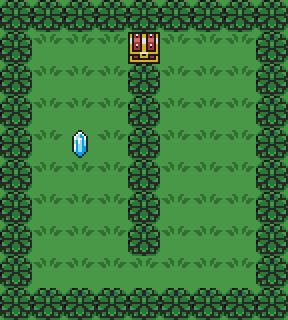

# Reinforcement Learning Assignment

### Source:
The following are the files required to build your reinforcement learning algorithm.

- [common.py](common.py) with constants
- [util.py](util.py) with util functions
- [game.py](game.py) with drawing calls
- [environment.py](environment.py) contains the scenario behavior
- [agent.py](agent.py) contains training components, such as environment interaction and previous state
- [link.py](link.py) contains a skeleton of methods that you must develop (yes, you can only change this file)

<a href="img/anim.gif" target="_blank">

</a>

### Execution

Use ```--debug``` flag to enable verbose output of train and coloring of Q(s, a) in the GUI.
During the GUI execution, you can switch to debug mode using SPACE key.

In order to test your code and get the convergence episode, you can use the environment.py file:
```
python environment.py [--debug] [Map]
```

To check the converged solution of your algorithm, you can run the GUI in debug mode and look the colors:
```
python game.py [--debug] [Map]
```
Bright colors means preferred directions, based on the learning in training phase.

### Implementation

The file [link.py](link.py) provides a basic skeleton to build your active reinforcement learning algorithm.

The train phase consists in X steps:
- Greedly choose and action and execute it in the environment
- Check the reward and learn about the executed action (using an utility table)
- If Link reaches a terminal state, check the convergence metric
- If it converges, stop the training
- If it does not converge, store the previous state of utility table and run another train episode

In the skeleton, you must fill the method to update the utility table (based on observed rewards),
a function to compute the utility based on the utility table (or just query the table, if you may),
a metric to identify if your learning algorithm has already converged and a method to store the
previous state of your utility table.
